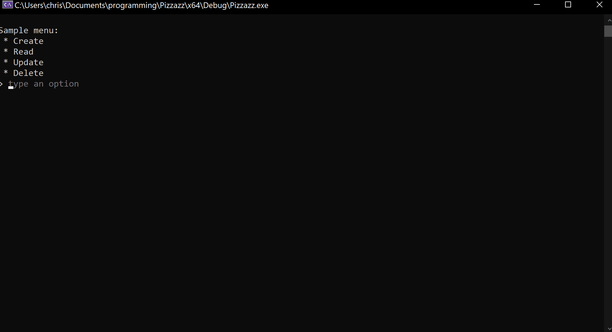

# Pizzazz

Add some color, style, advanced cursor movements, autocomplete suggestions, and more to your C++ terminal app!

This is a fully cross-platform library. See common.h and TextField.h for the list of functions and their descriptions. Take a look at tests.cpp for examples of how to use them. C++17 or newer is required; in Visual Studio, you can choose the version of C++ with project > Properties > C/C++ > Language > C++ Language Standard.

Here's a simple example of one of this library's functions, getline_autocompleted, which can give autocomplete suggestions and has optional built-in input validation:

```cpp
#include "pizzazz.h"
using namespace std;
namespace paz = pizzazz;  // shorter alias for easier use

int main() {
    cout << "\nSample menu:\n"
        " * Create\n"
        " * Read\n"
        " * Update\n"
        " * Delete\n"
        "> ";
    string choice = paz::getline_autocompleted(
        { "Create", "Read", "Update", "Delete" },
        "type an option");
    cout << "\nYou chose " << choice << endl;
    return 0;
}
```


